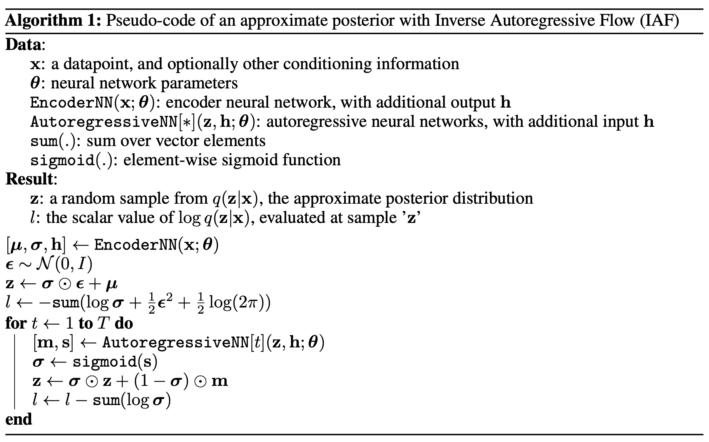

# [Improving Variational Inference with Inverse Autoregressive Flow](https://arxiv.org/abs/1606.04934)

Diederik P. Kingma, Tim Salimans, Rafal Jozefowicz, Xi Chen, Ilya Sutskever, Max Welling

This repository is the re-implementation of Inverse Autoregressive Flow with [MADE](https://arxiv.org/abs/1502.03509) based IAF layers. The IAF layer algorithm and the architecture is given below. The experiments with 2 syntetic datasets are provided in [Experiments.ipynb](Experiments.ipynb)

Section 4 in the original paper

Figure 2 in the original paper

